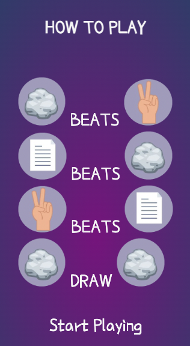
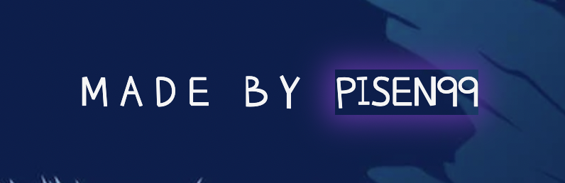

# Rock, Paper & Scissor +   [Play the game here!](https://pisen99.github.io/Project-2.ci/)
RockPaperScissor+ is a simple game for all the ages. It's most common to play as kids but even grown ups play this game. The game is played when you want to settle something between two people. It's easy to compare the idea behind the game to "coin-flipping" or "rolling a dice", winner gets to decide what to do after that. First to five wins the dispute between the two people.

## Index - Table of contents
* [Description](#description)
* [User Experience](#user-experience)
* [Features](#excisting-features)
* [Design](#design)
* [Technologies used](#technological-used)
* [Validator tests](#validator-test)
* [Deployment](#deployment)
* [Credits](#credits)

## Description

### How to play:
* Rock beats scissor.
* Scissor beats paper.
* Papper beats rock.

### Three results:
* Win, awards 1 point.
* Lose, awards 0 points.
* Draw, awards 0 points to both players.

### Game ends when:
* Whoever reaches five points first will win this game.

## User Experience

### A.First Time Visitor Goals
  a. As a first time visitor, I want to quick and easily understand the game's purpose.
  b. As a first time visitor, I want to navigate fast and easily on the website to find information about the game.
  
### B.Returning Visitor Goals
  a. As a returning visitor, I want to easily navigate through the rules to find out how this game works.
  b. As a returning visitor, I want to find the buttons easily and take me to the right place.

## Excisting Features

## f1 Header and buttons
    The header and buttons has an easy navigation to it on different devices, 380px, 768px and 3840px.
    It will be easy to find the buttons right under the logo with a simple yet informative icon.
    The icons will make a smal but noticible change when user hovers over them.
    Once you press the book icon it will appear with the rules for the game and an easy navigation to go back to the game.

## f2 Background image
    I wanted to create a background to give the website a more fun approach to it making the user want to stay for longer.

## f3 Footer
    I made this for the user to see who made the game. In the footer the name "Pisen99" is highlighted and linked to all the github repositories created by that name. The inspiration for this idea is from https://iama3191.github.io/rock-paper-scissors-lizard-spock/.

## Design

### Flexbox
* Using flexbox rather than margins or borders. This will keep the code more clean and responds easier to responsive design.

### Color scheme
* To tie the game on the webpage togheter I used two main colors, Rebecca Purple for shadowing and border frames. I used Cultured to set text color and style icons. The rest of the colors were used in shading text-boxes to create an ombre effect and reflect all the colours being used on the website.

### Background-image
* I wanted my webpage to have a background that goes well with the color of the img buttons as well as the text color.

### Buttons with Icon
* Keeping it simple and clean so user can focus mainly on the game. If user is unsure they will easily find the icons easy to accsess and understandeble any time during their game. A simple highlight of the buttons will appear when user hovers over them.

### Buttons with img
* Tying it all togheter with the purple color for the buttons with a frame the same color as some parts of the background-image. When user hovers over the button it will slightly scale softly up and down when user moves the mouse from it.

### Game history
* Created game history with a lower opacity so user can see what selection was actually played from "you" and "computer" without it taking over the whole game, easy for the eye. The winner of that round will show easily as the score will increase by one point.

### Typhography
* For heading and texts "Poor Story regular 400" is used. It has a playfull look to it that will work with the rest of the website. I only use one font to keep it easy, since the background has different shades of blue i didnt want to make the rest messy.

## Technological used
  
### Language used,
      HTML5 
      CSS3
      JavaScript
      
### Programs and Libraries used,
      Google fonts used to import "Poor Story regular 400"
      Font Awesome used to get icons "<i class="fa-solid fa-book"></i>" and "<i class="fa-solid fa-rotate-left"></i>"
      Github/Gitpod used to save code, commits and pushes.

## Validator test
      
### HTML:
First time I tried it, I expected everything to work but it seemed to be a missed spelling on line 37 '<section>'. This makes sense to why I couldn't add the footer that I had planed to do. I fixed the spelling mistake and added the footer. I changed some sections that doesn't have any headings to divs.

Before and after I changed the spelling error and made section in to divs instead, here's the result:
* First test.

* Second test.

### CSS:
No problem in this test, it gave a good result.

## Lighthouse:
No problem in this test, it gave a good result on both desktop and devices.

## JavaScript:
A smal comment on this part. "d" in my JavaScript is only used for one thing, that is "d.remove()".

## Deployment
* The site was created in GitHub pages, these are the steps to deploy:
  * Log in to GitHub and go to repositories.
  * In GitHub on the right side of the repository click on settings.
  * In settings on the left side menu select "Pages".
  * Under branch, select "Main" and select folder "(Root)"
  * Press save and the page will automatically refresh and your site will be att the top. It might take a few minutes, be patient.

## Credits
Icones comes from [here](https://fontawesome.com/)

Font-type comes from [here](https://fonts.google.com/knowledge)

Used as an inspiration for structure and javascript when making the rules popup:
[Iama3191](https://iama3191.github.io/rock-paper-scissors-lizard-spock/)
      
Used to create an open and close function in javaScript: [stackowerflow](https://stackoverflow.com/questions/21070101/show-hide-div-using-javascript)
      
Used to create basic structure and inspiration in JavaScript: [WebDevSimplify](https://www.youtube.com/watch?v=1yS-JV4fWqY)

Used to learn [flexbox](https://flexboxfroggy.com/)

Used to arrange the [colors](https://coolors.co/6033a3-3c1563-800080-f5f5f5-4054ae) for readme.

Images taken from:
[background-img](https://www.freepik.com/free-vector/night-landscape-with-mountains-full-moon_21087495.htm#query=space%20background&position=23&from_view=keyword)

Selection [buttons](https://www.pinterest.com/pin/korean-learning--721983384017175722/)
